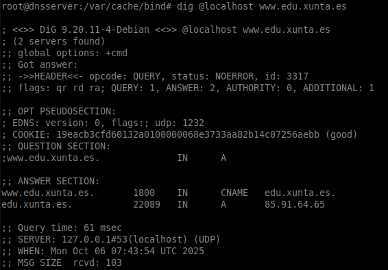
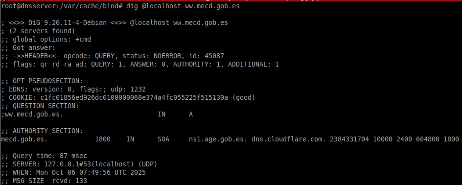
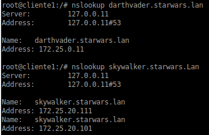
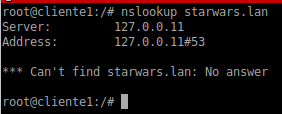
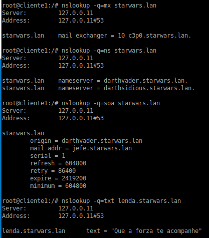
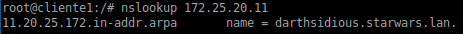

### Entrega del Ejercicio 1.1 Instalación de zonas mestras primarias
---

# 1 Comprobación del funcionamiento del dns dnsserver

# 2 Comprobación del funcionamiento de los reenviadores

# 3 Comprobación de los registros

